# Flutter Projects

This repository contains several Flutter projects developed by me. 
## Projects

### 1. Calcy (Calculator App)
<div style="display: flex; justify-content: space-between;">
    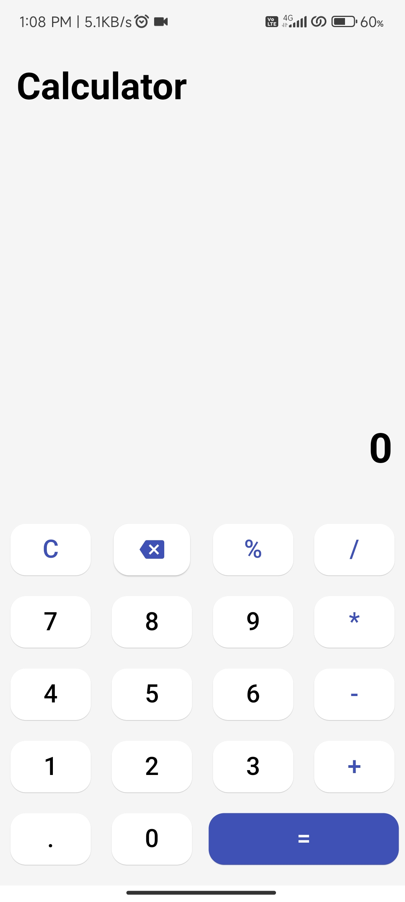
    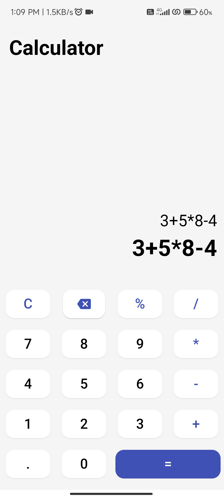
    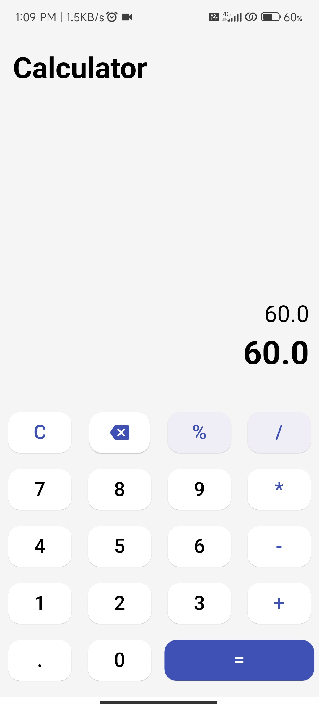
</div>
Calcy is a versatile calculator app built with Flutter. It provides a range of arithmetic operations and features to enhance user experience and functionality.

**Features:**

- Arithmetic Operations: Supports basic operations including addition, subtraction, multiplication, and division.
- Percentage Calculation: Includes functionality to perform percentage calculations.
- Multiple Operators and Operands: Capable of handling multiple operators and operands for complex calculations.
- Backspace: Allows users to correct mistakes by removing the last entered character.
- Clear All: Provides a button to reset the calculator and clear all entries.

### 2. BMI Calculator (BMI Calculator App)
<div style="display: flex; justify-content: space-between;">
    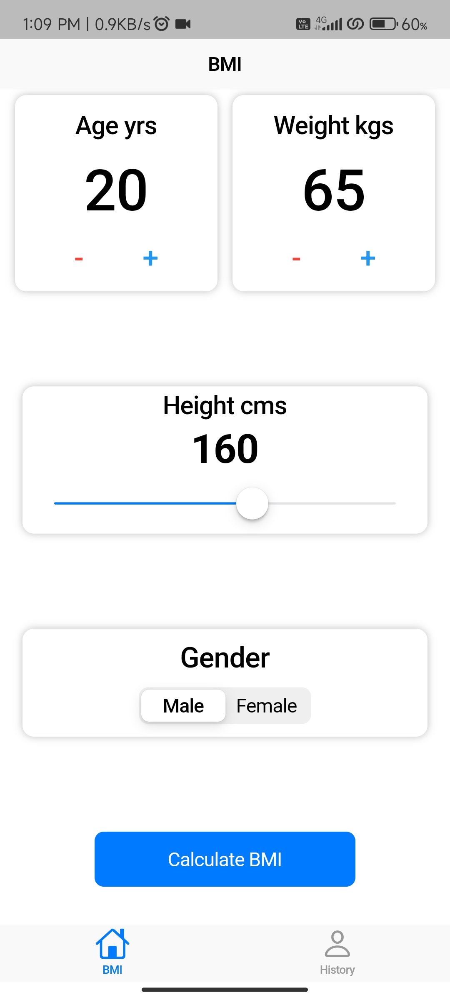
    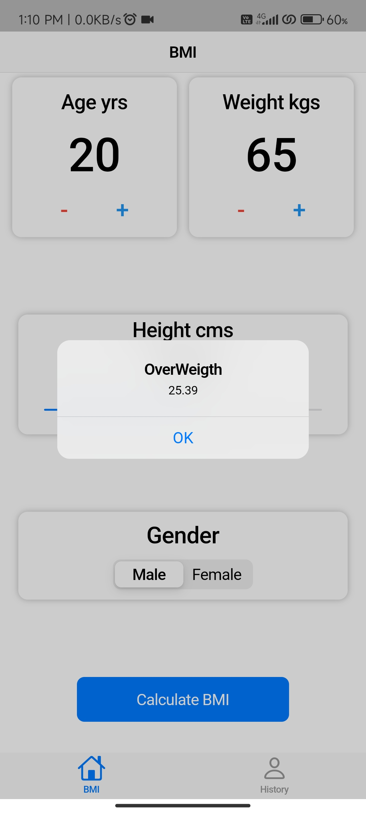
    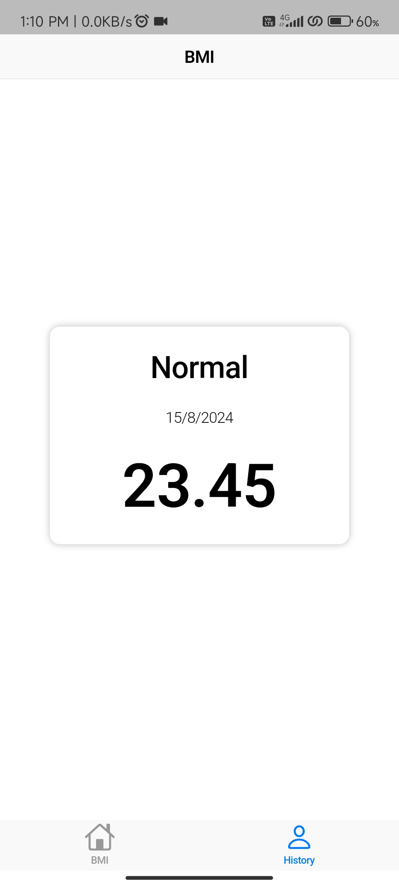
</div>
The BMI Calculator app is designed with a Cupertino style to provide an authentic iOS-like experience. It helps users calculate their Body Mass Index (BMI) and track their health over time with an intuitive and stylish interface.

**Features:**

- BMI Calculation: Allows users to input their height and weight to calculate their Body Mass Index (BMI). The app provides instant feedback on BMI values.
- Cupertino Style: Uses iOS-style components for a native look and feel, enhancing the user experience for iOS devices.
- Store and Display History: Saves each calculated BMI entry and displays it on a dedicated history screen, allowing users to track their BMI changes over time.
- Interactive Interface: Features user-friendly inputs and results display, designed to ensure a smooth and enjoyable interaction.
  
### 3. Filmy (Movie Search App)
<div style="display: flex; justify-content: space-between;">
    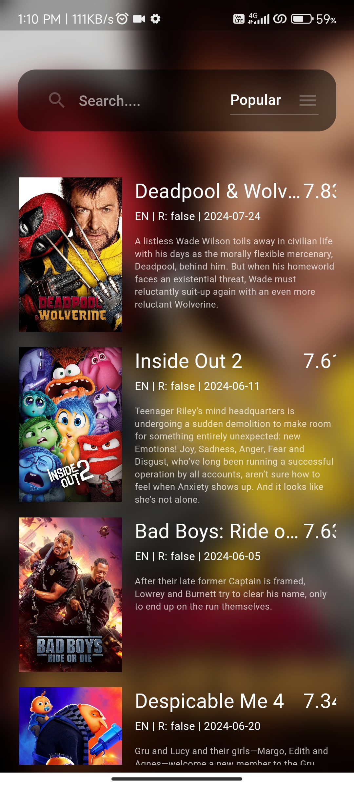
    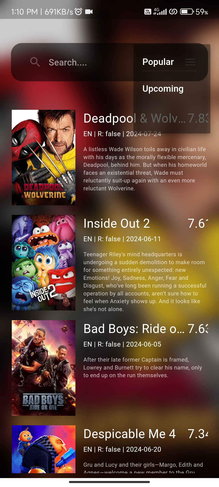
    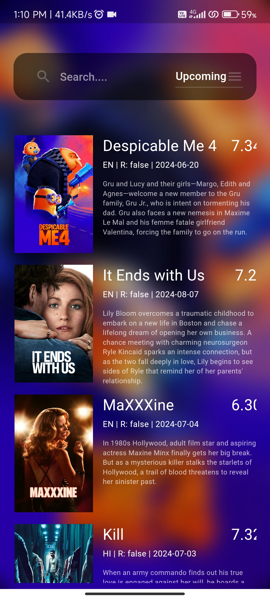
</div>
Filmy is a movie information app that leverages the TMDB (The Movie Database) API to provide users with up-to-date information on popular and upcoming movies. It offers an engaging interface for exploring movies and searching through different categories.

**Features:**

- Popular Movies: Displays a list of popular movies currently trending worldwide, sourced from the TMDB API.
- Upcoming Movies: Shows a list of upcoming movies that are set to be released soon, with detailed information.
- Search Functionality: Allows users to search for movies within both the popular and upcoming categories, making it easy to find specific titles.
- Movie Details: Provides detailed information about each movie, including synopsis, cast, release dates, and ratings.
- Interactive Interface: Features a sleek and user-friendly interface to browse and search through movie lists efficiently.
  
### 4. Taskly (ToDo - App)
<div style="display: flex; justify-content: space-between;">
    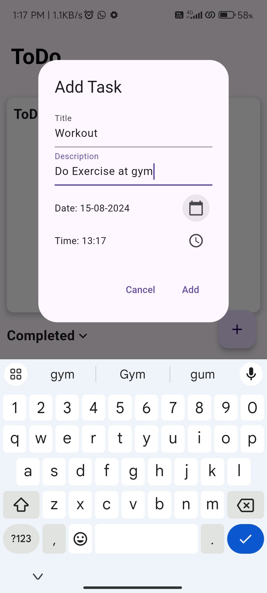
    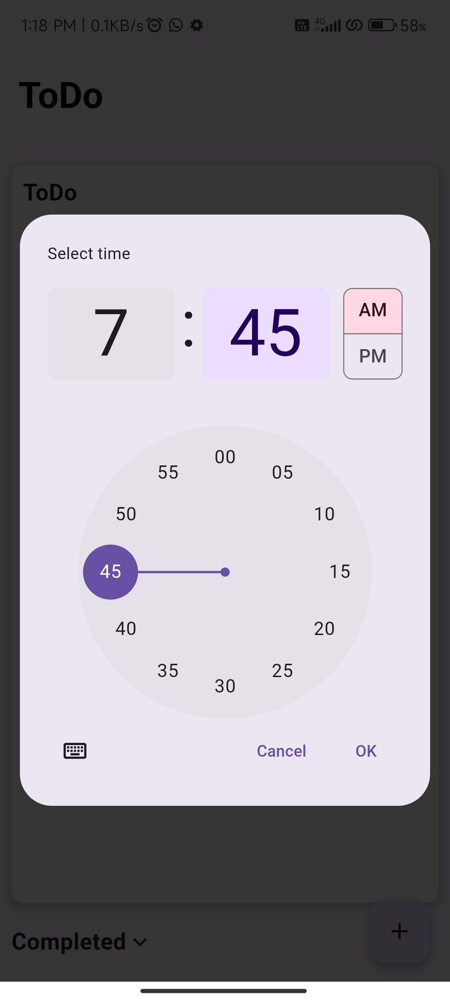
    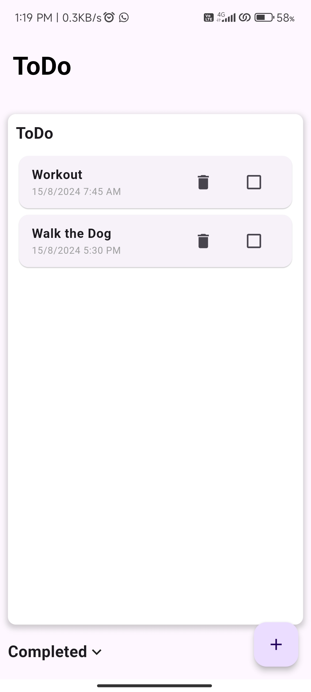
</div>
<div style="display: flex; justify-content: space-between;">
  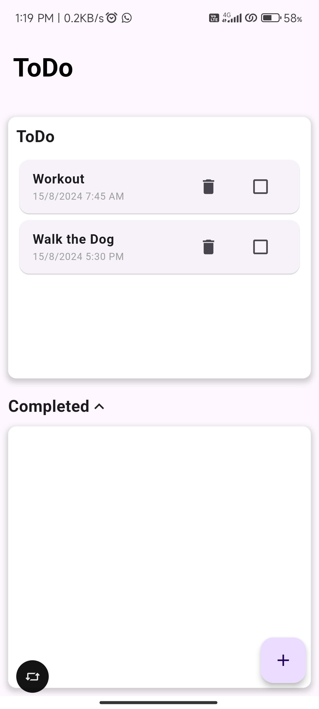
  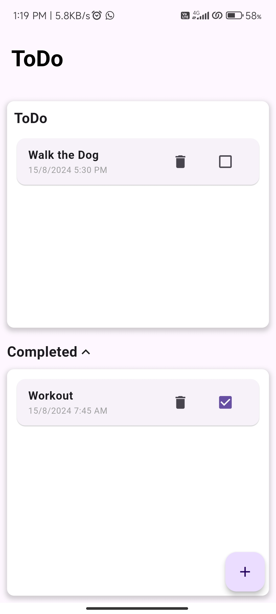
  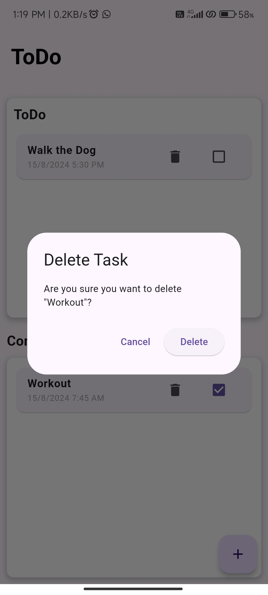
</div>
Taskly is a comprehensive task management app designed to help users organize and keep track of their tasks efficiently. The app features a clean and intuitive interface that allows users to manage tasks with timestamps and dates, and provides functionality to mark tasks as complete, and organize them into different sections.

**Features:**

- Task Creation: Easily create new tasks with a timestamp and due date to keep track of when they need to be completed.
- Task Management:  Delete tasks that are no longer needed.
- Task Completion: Check off tasks to mark them as completed, which will move them to the Completed section.
- User-Friendly Interface: Features an easy-to-use interface for adding, editing, and managing tasks efficiently.
  
### 5. Trivia 
<div style="display: flex; justify-content: space-between;">
    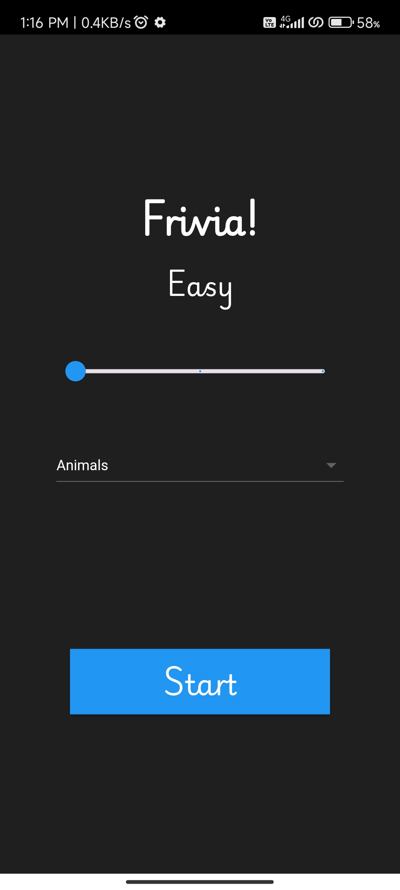
    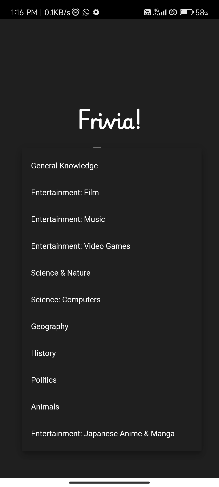
    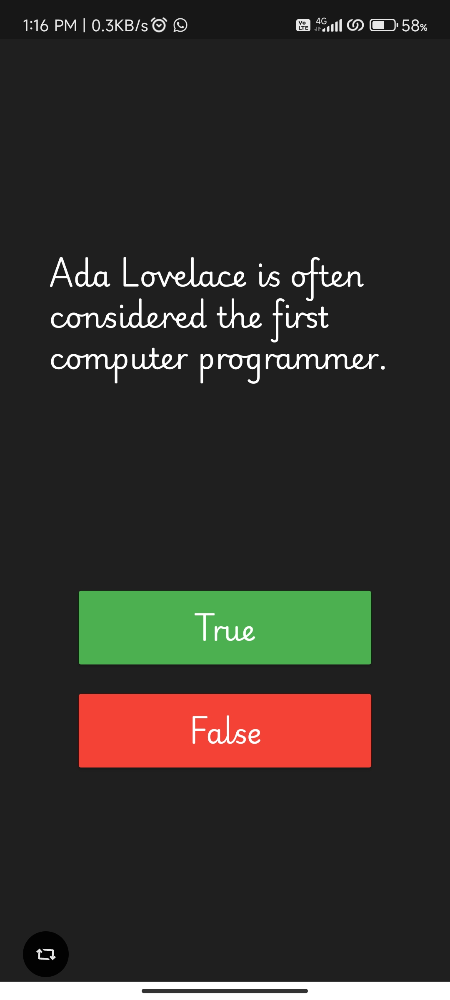
</div>
The Trivia app offers an engaging quiz experience by leveraging the Open Trivia API. It allows users to test their knowledge with questions across various categories and difficulty levels. With a user-friendly interface and interactive gameplay, the app provides a fun way to challenge yourself and test your trivia skills.

**Features:**

- Difficulty Levels: Choose from three difficulty levels - Easy, Medium, and Hard - to customize the quiz experience.
- Multiple Categories: Select from a wide range of categories provided by the Open Trivia API to take quizzes on different topics.
- 10-Question Quiz: Answer 10 True or False questions in each quiz session.
- Result Display: After answering all questions, view your results including the number of correct answers.
- Open Trivia API Integration: Utilizes the Open Trivia API to fetch a diverse set of trivia questions, ensuring a rich and challenging quiz experience.
  
## Getting Started

To run any of these projects locally, follow these steps:

1. Clone the repository:
    ```bash
    git clone https://github.com/AlaguSaravanan/Flutter-Projects.git
    ```
2. Navigate to the project directory you want to explore:
    ```bash
    cd Flutter-Projects/project-name
    ```
3. Install dependencies:
    ```bash
    flutter pub get
    ```
4. Run the app:
    ```bash
    flutter run
    ```
